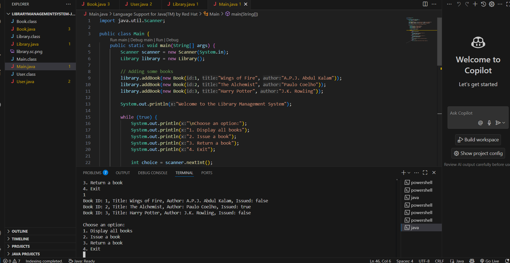

# JavaConsoleLibraryApp

A simple **Library Management System** built in Java, showcasing Object-Oriented Programming (OOP) concepts through a console-based interface. This beginner-friendly project manages a collection of books using real-world programming logic.

## 📚 Features
- Add new books to the library
- Display the list of all books
- Issue books by ID
- Return books by ID

## 🛠 Tools Used
- Java
- Visual Studio Code
- Terminal / Command Prompt

## 💡 OOP Concepts Covered
- **Abstraction**: Hiding internal details and showing functionality
- **Encapsulation**: Protecting data using private variables and public methods
- **Inheritance**: Using shared properties in different classes
- **Polymorphism**: Performing tasks in multiple forms

## 📦 Java Classes
- `Book`: Represents the book entity with title, author, ID, and issued status
- `User`: Represents a library user (can be extended)
- `Library`: Manages books and handles operations like issue and return
- `Main`: Entry point of the program, contains the menu and flow logic

## ▶️ How to Run

```bash
javac *.java
java Main
```

## 🖼 Sample Output



---

## 👨‍💻 Author  
**Puchalapalli Eeswari Devi**

🔗 GitHub Repository: [JavaConsoleLibraryApp](https://github.com/Puchalapallieeswaridevi/JavaConsoleLibraryApp)

---

Thank you for checking out my Java Library Management System! 😊  
Feel free to explore the code, try it out, and suggest improvements.
